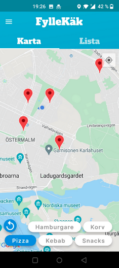

# Backend for RestaurantApp

Backend for RestaurantApp built with Java and Spring.  
There are three endpoints /add /delete /all, that can be used to read or manipulate data in the database.  
 visual of the app:

--------------

